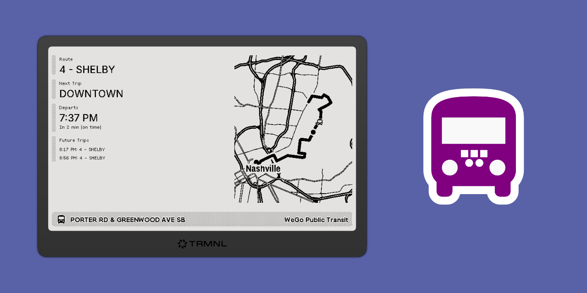

# WeGo Public Transit Next Trip

[](https://github.com/transitnownash/trmnl-wego-next-trip/actions/workflows/build.yml)



## Screenshots


## Development

### Releasing

This project uses automated releases based on the `VERSION` file. To create a new release:

1. Update the version using the bump script:
   ```bash
   ./bin/bump-version [major|minor|patch]
   ```

2. Commit and push the version change:
   ```bash
   git add VERSION
   git commit -m "Bump version to X.Y.Z"
   git push origin main
   ```

3. The GitHub Action will automatically:
   - Create a git tag for the new version
   - Generate release notes from commits
   - Create a GitHub release
   - Deploy to TRMNL using `trmnlp push`

### Manual Development

For local development and testing:

```bash
# Run development server
./bin/dev

# Push to TRMNL (requires API key configuration)
trmnlp push
```
